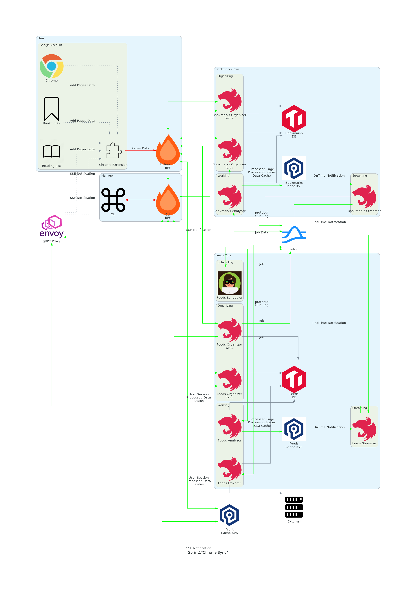

# Architectures

## Legend

## Sprint1

- Base Architecture (BFF/KVS/Queue/MicroService)
- Simple Feature (Add Bookmark)
- Basic Authentication
- Use gRPC
- Use tRPC
- Use Hono
- Use Pulsar
- Use TiDB Serverless

## Sprint2

- Implementation Management UI
- Implementation User UI
- Support Firefox Account

## Goal

- Use ElasticSearch
- Pages Analyzer
- Hatena Bookmark API
- Pocket API
- Pages Suggester
- RSS Reader
