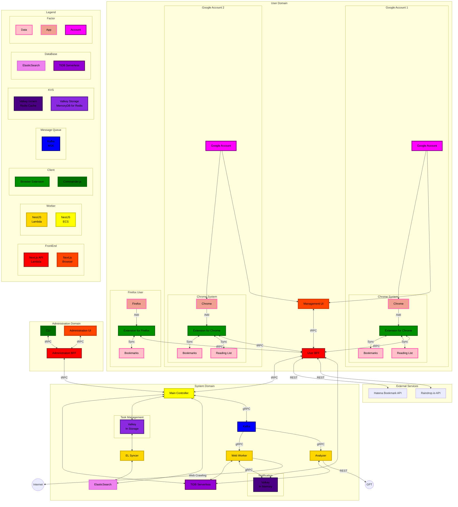

```mermaid
graph TD

  subgraph "User Domain"
    subgraph "Google Account 1"
      GA1[Google Account]
      GA1 --> C1

      subgraph "Chrome System"
        C1[Chrome]
        CB1[Bookmarks]
        CRL1[Reading List]
        E1[Extension for Chrome]
        C1 -->|Add| E1
        E1 <-->|Sync| CB1
        E1 <-->|Sync| CRL1
      end
    end

    subgraph "Google Account 2"
      GA2[Google Account]
      GA2 --> C2

      subgraph "Chrome System"
        C2[Chrome]
        CB2[Bookmarks]
        CRL2[Reading List]
        E2[Extension for Chrome]
        C2 -->|Add| E2
        E2 <-->|Sync| CB2
        E2 <-->|Sync| CRL2
      end
    end

    subgraph "Firefox User"
      FF[Firefox]
      FB[Bookmarks]
      EF[Extension for Firefox]
      FF -->|Add| EF
      EF <-->|Sync| FB
    end

    MUI[Management UI]
    GA1 --> MUI
    GA2 --> MUI

    UBFF[User BFF]
  end

  subgraph "External Services"
    HB[Hatena Bookmark API]
    RD[Raindrop.io API]
  end

  subgraph "System Domain"

    subgraph "Task Management"
      VKS[Valkey<br/>In Storage]
    end

    subgraph "Notification"
      VKM[Valkey<br/>In Memory]
    end

    MC[Main Controller]
    WW[Web Worker]
    A[Analyzer]
    Kafka[Kafka]
    TDS[TiDB Serverless]
    EL[ElasticSearch]
    ELS[EL Syncer]

    MC <--> TDS
    WW <--> TDS
    A <--> TDS

    VKM <--> UBFF

    ELS <--> EL
    VKS <--> ELS

    MC <--> VKS
    MC <--> EL

    Kafka -->|gRPC| WW
    MC <-->|gRPC| Kafka
  end

  subgraph "Administration Domain"
    CLI[CLI]
    AUI[Administration UI]
    ABFF[Administration BFF]
  end

  E1 <-->|tRPC| UBFF
  E2 <-->|tRPC| UBFF
  EF <-->|tRPC| UBFF
  MUI <-->|tRPC| UBFF

  UBFF <-->|tRPC| MC
  ABFF <-->|tRPC| MC

  UBFF <-->|REST| HB
  UBFF <-->|REST| RD

  CLI <-->|tRPC| ABFF
  AUI <-->|tRPC| ABFF

  WW <-->|gRPC| VKM

  WW -->|Web Crawling| Internet((Internet))

  Kafka -->|gRPC| A
  A -->|REST| GPT((GPT))

  subgraph Legend
    subgraph "FrontEnd"
      L_NextLambda[Next.js API<br/>Lambda]
      L_NextFront[Next.js<br/>Browser]
    end

    subgraph "Worker"
      L_NestLambda[NestJS<br/>Lambda]
      L_NestECS[NestJS<br/>ECS]
    end

    subgraph "Client"
      L_Extension[Browser Extension]
      L_Commander[Commander.js]
    end

    subgraph "Message Queue"
      L_Kafka[Kafka<br/>MSK]
    end

    subgraph "KVS"
      L_Valkey_Inmem[Valkey Inmem<br/>Redis Cache]
      L_Valkey_Storage[Valkey Storage<br/>MemoryDB for Redis]
    end

    subgraph "DataBase"
      L_ElasticSearch[ElasticSearch]
      L_TiDB[TiDB Serverless]
    end


    subgraph "Factor"
      L_Data[Data]
      L_App[App]
      L_Account[Account]
    end
  end

  classDef nextLambdaStyle fill:#FF0000,stroke:#991F1F,stroke-width:4px,color:#000;
  class L_NextLambda nextLambdaStyle;
  class UBFF,ABFF nextLambdaStyle;

  classDef nextFrontStyle fill:#FF4500,stroke:#CC3700,stroke-width:4px,color:#000;
  class L_NextFront nextFrontStyle;
  class MUI,AUI nextFrontStyle;

  classDef nestLambdaStyle fill:#FFD700,stroke:#CCAC00,stroke-width:4px,color:#000;
  class L_NestLambda nestLambdaStyle;
  class WW,ELS,A nestLambdaStyle;

  classDef nestECSStyle fill:#FFFF00,stroke:#CCCC00,stroke-width:4px,color:#000;
  class L_NestECS nestECSStyle;
  class MC nestECSStyle;

  classDef extensionStyle fill:#009000,stroke:#006400,stroke-width:4px,color:#000;
  class L_Extension extensionStyle;
  class E1,E2,EF extensionStyle;

  classDef commanderStyle fill:#007000,stroke:#006400,stroke-width:4px,color:#000;
  class L_Commander commanderStyle;
  class CLI commanderStyle;

  classDef kafkaStyle fill:#0000FF,stroke:#00008B,stroke-width:4px,color:#000;
  class L_Kafka kafkaStyle;
  class Kafka kafkaStyle;

  classDef valkeyMemoryStyle fill:#4B0082,stroke:#2E0854,stroke-width:4px,color:#000;
  class L_Valkey_Inmem valkeyMemoryStyle;
  class VKM valkeyMemoryStyle;

  classDef valkeyStorageStyle fill:#8A2BE2,stroke:#551A8B,stroke-width:4px,color:#000;
  class L_Valkey_Storage valkeyStorageStyle;
  class VKS valkeyStorageStyle;

  classDef tidbStyle fill:#9400D3,stroke:#660066,stroke-width:4px,color:#000;
  class L_TiDB tidbStyle;
  class TDS tidbStyle;

  classDef elasticSearchStyle fill:#EE82EE,stroke:#DA70D6,stroke-width:4px,color:#000;
  class L_ElasticSearch elasticSearchStyle;
  class EL elasticSearchStyle;

  classDef dataStyle fill:#FFC0CB,stroke:#FF69B4,stroke-width:4px,color:#000;
  class L_Data dataStyle;
  class CRL1,CRL2,CB1,CB2,FB dataStyle;

  classDef appStyle fill:#F1A091,stroke:#FF6EB4,stroke-width:4px,color:#000;
  class L_App appStyle;
  class C1,C2,FF appStyle;

  classDef accountStyle fill:#FF00FF,stroke:#8B008B,stroke-width:4px,color:#000;
  class L_Account accountStyle;
  class GA1,GA2 accountStyle;

```
