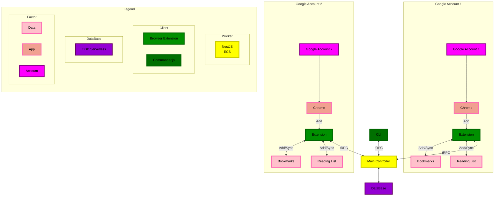

```mermaid
graph TD

    subgraph "Google Account 1"
        GA1[Google Account 1]
        C1[Chrome]
        CB1[Bookmarks]
        CRL1[Reading List]
        E1[Extension]

        GA1 --> C1
        C1 -->|Add| E1
        E1 <-->|Add/Sync| CB1
        E1 <-->|Add/Sync| CRL1
    end

    subgraph "Google Account 2"
        GA2[Google Account 2]
        C2[Chrome]
        CB2[Bookmarks]
        CRL2[Reading List]
        E2[Extension]

        GA2 --> C2
        C2 -->|Add| E2
        E2 <-->|Add/Sync| CB2
        E2 <-->|Add/Sync| CRL2
    end

    MC[Main Controller]
    CLI[CLI]
    TDS[DataBase]

    E1 <-->|tRPC| MC
    E2 <-->|tRPC| MC

    CLI <-->|tRPC| MC

    MC <--> TDS

    subgraph Legend
        direction TB

        subgraph "Worker"
            L_NestECS[NestJS<br/>ECS]
        end

        subgraph "Client"
            L_Extension[Browser Extension]
            L_Commander[Commander.js]
        end

        subgraph "DataBase"
            L_TiDB[TiDB Serverless]
        end


        subgraph "Factor"
            L_Data[Data]
            L_App[App]
            L_Account[Account]
        end
    end

    classDef nextLambdaStyle fill:#FF0000,stroke:#991F1F,stroke-width:4px,color:#000;
    class L_NextLambda nextLambdaStyle;
    class UBFF,ABFF nextLambdaStyle;

    classDef nextFrontStyle fill:#FF4500,stroke:#CC3700,stroke-width:4px,color:#000;
    class L_NextFront nextFrontStyle;
    class MUI,AUI nextFrontStyle;

    classDef nestLambdaStyle fill:#FFD700,stroke:#CCAC00,stroke-width:4px,color:#000;
    class L_NestLambda nestLambdaStyle;
    class WW,ELS,A nestLambdaStyle;

    classDef nestECSStyle fill:#FFFF00,stroke:#CCCC00,stroke-width:4px,color:#000;
    class L_NestECS nestECSStyle;
    class MC nestECSStyle;

    classDef extensionStyle fill:#009000,stroke:#006400,stroke-width:4px,color:#000;
    class L_Extension extensionStyle;
    class E1,E2,EF extensionStyle;

    classDef commanderStyle fill:#007000,stroke:#006400,stroke-width:4px,color:#000;
    class L_Commander commanderStyle;
    class CLI commanderStyle;

    classDef kafkaStyle fill:#0000FF,stroke:#00008B,stroke-width:4px,color:#000;
    class L_Kafka kafkaStyle;
    class Kafka kafkaStyle;

    classDef valkeyMemoryStyle fill:#4B0082,stroke:#2E0854,stroke-width:4px,color:#000;
    class L_Valkey_Inmem valkeyMemoryStyle;
    class VKM valkeyMemoryStyle;

    classDef valkeyStorageStyle fill:#8A2E2,stroke:#551A8B,stroke-width:4px,color:#000;
    class L_Valkey_Storage valkeyStorageStyle;
    class VKS valkeyStorageStyle;

    classDef tidbStyle fill:#9400D3,stroke:#660066,stroke-width:4px,color:#000;
    class L_TiDB tidbStyle;
    class TDS tidbStyle;

    classDef elasticSearchStyle fill:#EE82EE,stroke:#DA70D6,stroke-width:4px,color:#000;
    class L_ElasticSearch elasticSearchStyle;
    class EL elasticSearchStyle;

    classDef dataStyle fill:#FFC0CB,stroke:#FF69B4,stroke-width:4px,color:#000;
    class L_Data dataStyle;
    class CRL1,CRL2,CB1,CB2,FB dataStyle;

    classDef appStyle fill:#F1A091,stroke:#FF6EB4,stroke-width:4px,color:#000;
    class L_App appStyle;
    class C1,C2,FF appStyle;

    classDef accountStyle fill:#FF00FF,stroke:#8B008B,stroke-width:4px,color:#000;
    class L_Account accountStyle;
    class GA1,GA2 accountStyle;

```
